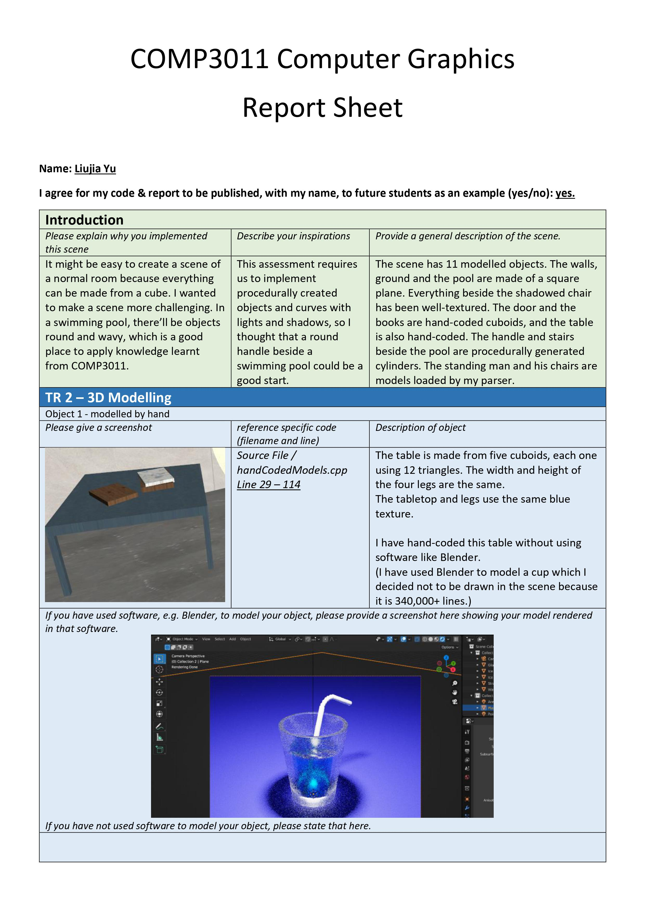
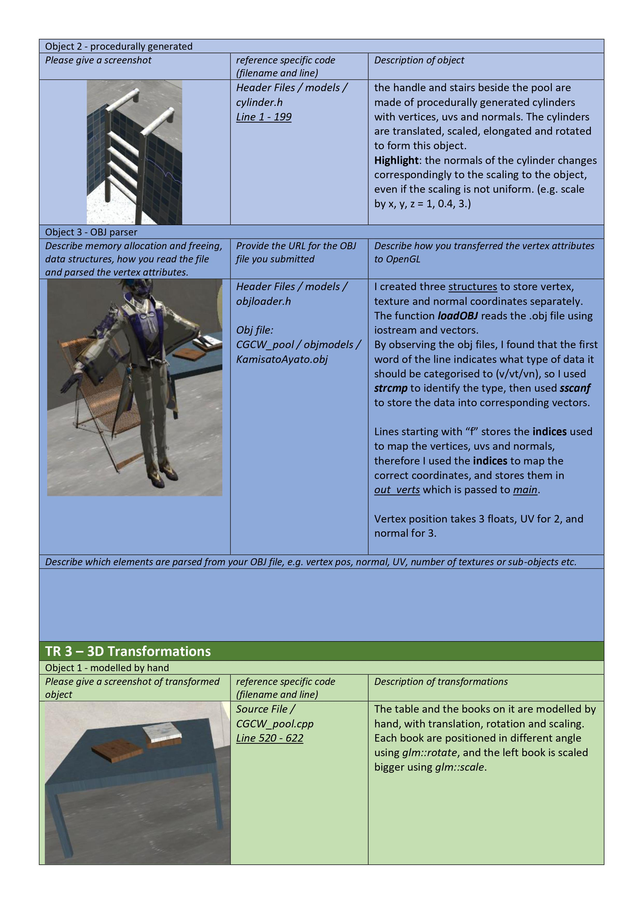
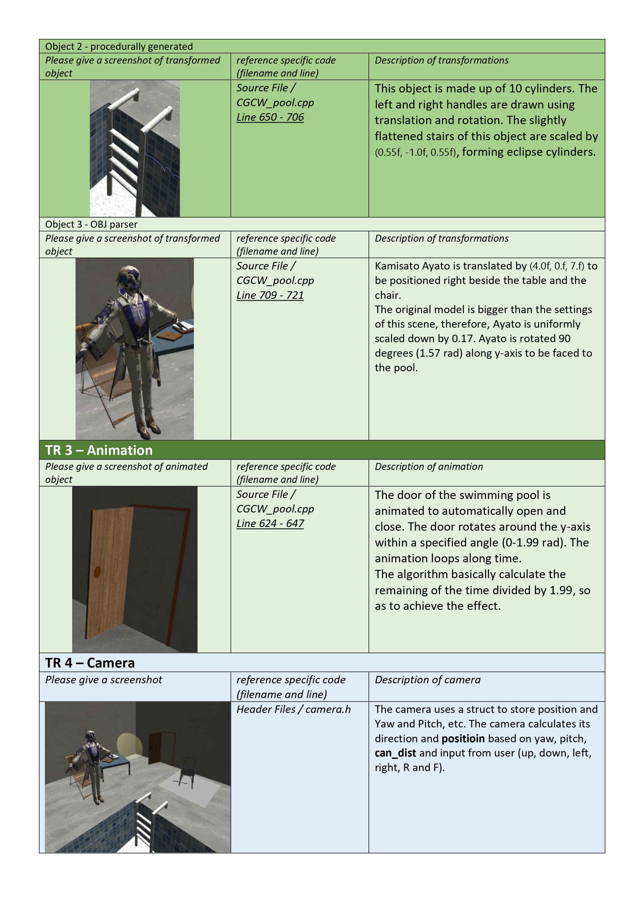
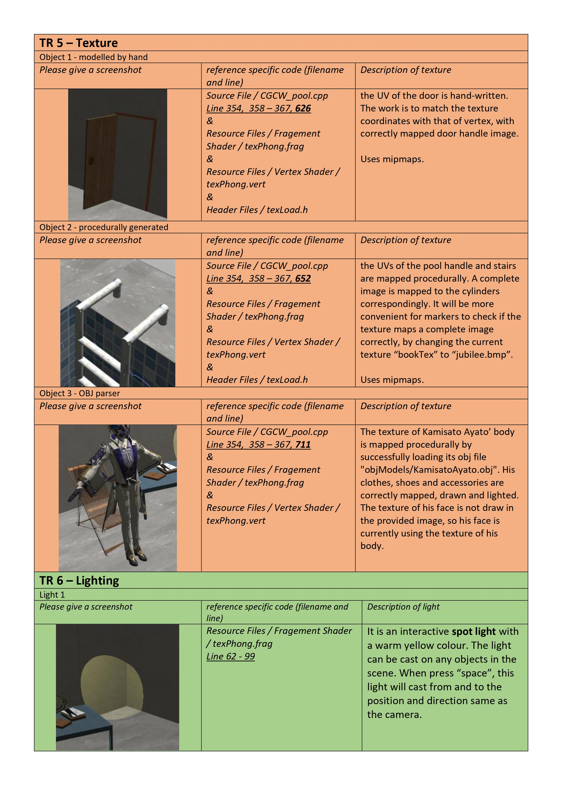
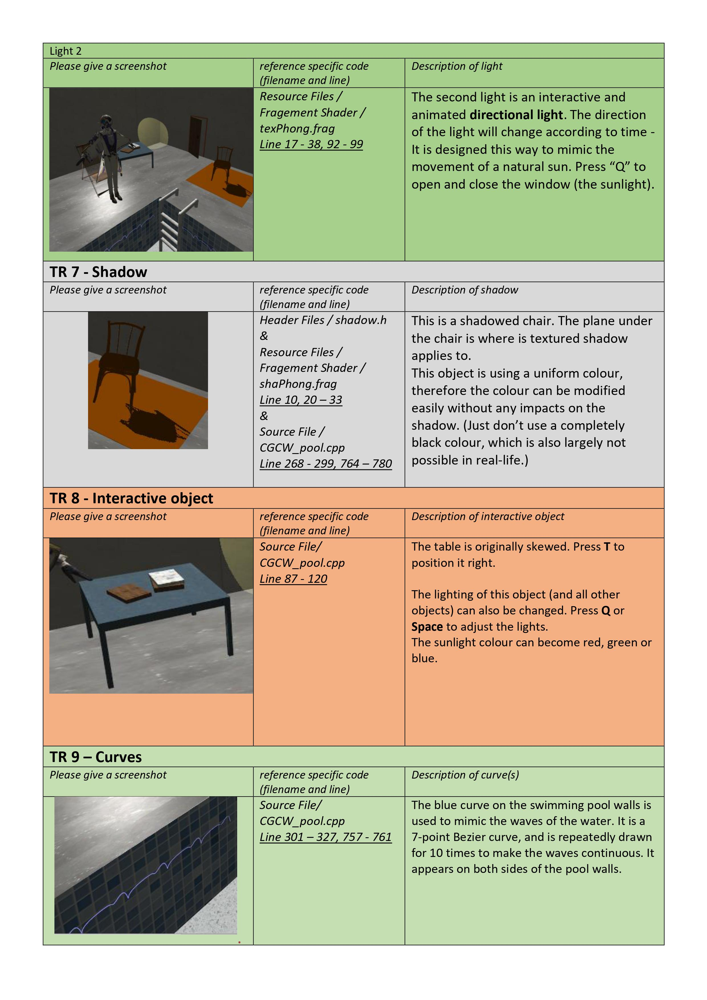
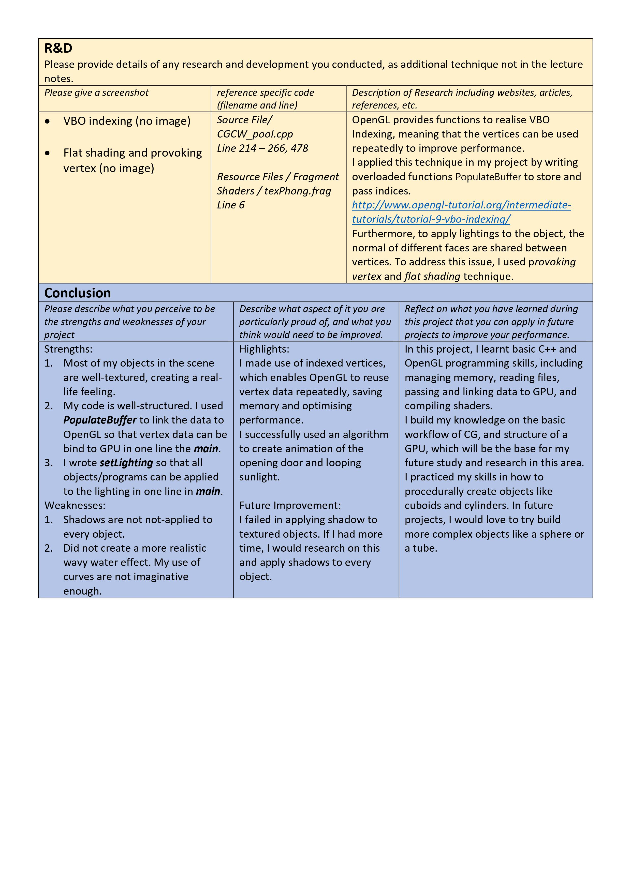

### Written by: Liujia Yu (Lesley)

---

# Introduction

This project is developed based on lectures and materials of the course COMP3011 Computer Graphics in the University of Nottingham.

#### Briefs

The scene has 11 modelled objects. The walls, ground and the pool are made of a square plane. Everything beside the shadowed chair has been well-textured. The door and the books are hand-coded cuboids, and the table is also hand-coded. The handle and stairs beside the pool are procedurally generated cylinders. The standing man and his chairs are models loaded by my parser.

#### Inspirations

The final coursework assignment requires us to implement procedurally created objects and curves with lights and shadows, so I thought that a round handle beside a swimming pool could be a good start.

# How to use

## Report Sheet

